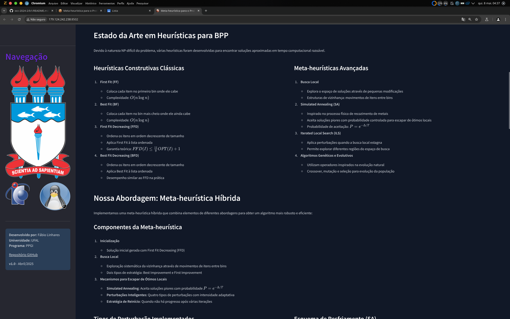
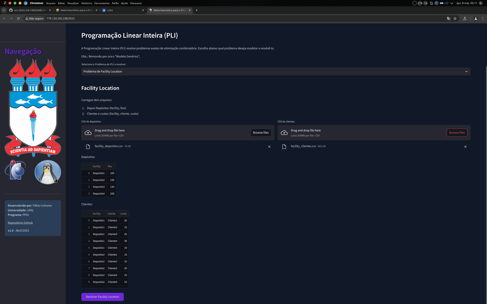
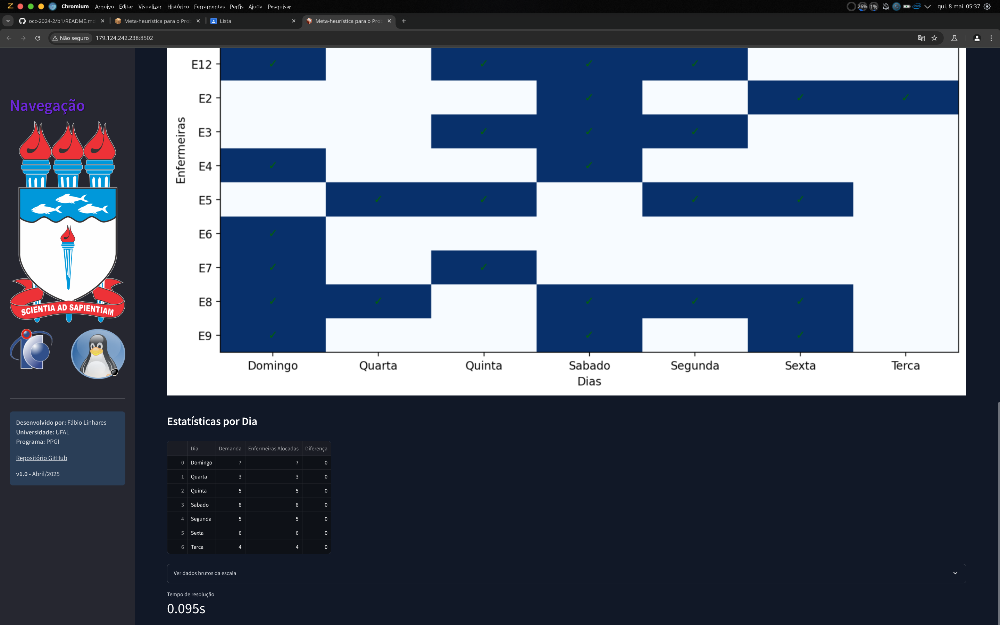
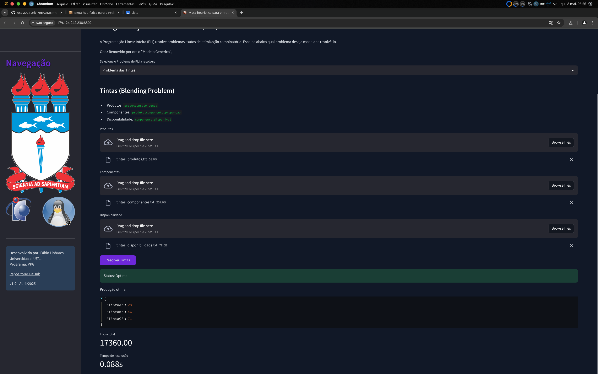

# Meta-heurística para o Problema de Bin Packing

Este projeto implementa uma meta-heurística híbrida para resolver o problema de Bin Packing de forma eficiente. A aplicação inclui uma interface web interativa para visualização e experimentação com diferentes instâncias do problema.

## O Problema de Bin Packing

O problema de Bin Packing consiste em empacotar um conjunto de itens com dimensões variadas em recipientes (bins) de capacidade fixa, minimizando o número total de recipientes utilizados. Este é um problema NP-difícil clássico com aplicações em diversas áreas como logística, manufatura e alocação de recursos.

## Nossa Abordagem

Implementamos uma meta-heurística híbrida que combina:
- Busca Local (Best/First Improvement)
- Simulated Annealing
- Iterated Local Search com perturbações adaptativas
- Estratégias de reinício

## Características

- Inicialização com First-Fit Decreasing
- Múltiplos tipos de perturbação para escapar de ótimos locais
- Visualização colorida dos itens em cada bin
- Métricas detalhadas sobre a qualidade da solução
- Interface interativa para carregamento de instâncias e configuração do algoritmo

## Screenshots e Exemplos

Aqui estão alguns exemplos de visualizações e resultados obtidos com nossa implementação:

### Interface Principal


### Apresentação




### Solução
#### Seleção da instância

#### Exibição dos bins

#### Detalhes dos bins


## Programação Linear Inteira (ILP)

Além da meta-heurística, este projeto também implementa soluções exatas utilizando Programação Linear Inteira (ILP) para uma variedade de problemas clássicos de otimização. A implementação usa a biblioteca PuLP para modelar e resolver os problemas.

## Como Utilizar

1. Acesse a aba "PLI" na interface da aplicação
2. Selecione o problema que deseja resolver
3. Carregue os arquivos de entrada correspondentes ao problema
4. Clique em "Resolver" para obter a solução ótima

A implementação utiliza o solver CBC através do PuLP, que é capaz de resolver problemas de médio porte com eficiência.


### Problemas Implementados

Nossa implementação inclui os seguintes problemas de otimização:

1. **Problema da Mochila (Knapsack Problem)**
   - **Descrição**: Selecionar itens com pesos e valores para maximizar o valor total sem exceder a capacidade da mochila.
   - **Arquivo**: `problema_mochila.txt` - Contém itens com seus pesos e valores, e a capacidade da mochila.
   - **Formato**: CSV com colunas: item, peso, valor (e uma linha para capacidade).

      **Screenshots:**
   - 
   - 
   - 

2. **Problema da Dieta**
   - **Descrição**: Selecionar alimentos minimizando o custo total enquanto atende requisitos nutricionais.
   - **Arquivos**: 
     - `dieta_alimentos.txt` - Alimentos com custos e valores nutricionais.
     - `dieta_requisitos.txt` - Requisitos mínimos e máximos de cada nutriente.
   - **Formato**: CSVs com informações nutricionais e limites.
   - 
      **Screenshots:**
   - 
   - 
   - 
   - 
   - 

3. **Problema da Ração**
   - **Descrição**: Determinar a produção ótima de diferentes tipos de ração para maximizar o lucro.
   - **Arquivos**: 
     - `racao_produtos.txt` - Produtos e seus lucros.
     - `racao_ingredientes.txt` - Relação entre produtos e ingredientes.
     - `racao_restricoes.txt` - Restrições de ingredientes.
   - **Formato**: CSVs com relações entre produtos, ingredientes e restrições.

      **Screenshots:**
   - 
   - 
   - 

4. **Problema do Caixeiro Viajante (TSP)**
   - **Descrição**: Encontrar o caminho mais curto que visita todas as cidades exatamente uma vez.
   - **Arquivo**: `problema_caixeiro_viajante.txt` - Matriz de distâncias entre cidades.
   - **Formato**: CSV com matriz de distâncias (linhas e colunas representando cidades).

      **Screenshots:**
   - 
   - 

5. **Problema de Cobertura (Set Covering)**
   - **Descrição**: Selecionar o menor número de conjuntos para cobrir todos os elementos.
   - **Arquivo**: `problema_cobertura.txt` - Matriz de incidência entre elementos e conjuntos.
   - **Formato**: CSV com matriz binária (elementos nas linhas, conjuntos nas colunas).

      **Screenshots:**
   - 

6. **Problema de Facility Location**
   - **Descrição**: Decidir quais depósitos abrir e como atender clientes minimizando custos.
   - **Arquivos**: 
     - `facility_depositos.txt` - Custos fixos de abertura de cada depósito.
     - `facility_clientes.txt` - Custos de atendimento de clientes por cada depósito.
   - **Formato**: CSVs especificando depósitos, clientes e custos.

      **Screenshots:**
   - 
   - 

7. **Problema de Fluxo de Custo Mínimo**
   - **Descrição**: Encontrar o fluxo de menor custo em uma rede.
   - **Arquivo**: `problema_fluxo_custo_minimo.txt` - Arcos da rede com custos e capacidades.
   - **Formato**: CSV com colunas: de, para, custo, capacidade.

      **Screenshots:**
   - 
   - 

8. **Problema do Caminho Mínimo**
   - **Descrição**: Encontrar o caminho mais curto entre dois nós em um grafo.
   - **Arquivo**: `problema_caminho_minimo.txt` - Arcos do grafo com custos.
   - **Formato**: Similar ao fluxo de custo mínimo.
  
      **Screenshots:**
   - 


9. **Problema do Fluxo Máximo**
   - **Descrição**: Maximizar o fluxo entre origem e destino em uma rede.
   - **Arquivo**: `problema_fluxo_maximo.txt` - Arcos da rede com capacidades.
   - **Formato**: CSV com colunas: de, para, capacidade.

      **Screenshots:**
   - 
   - 

10. **Problema de Escalonamento de Horários**
    - **Descrição**: Alocar enfermeiras a turnos satisfazendo demandas e restrições.
    - **Arquivo**: `problema_escalonamento.txt` - Demandas por dia.
    - **Formato**: CSV com colunas: dia, demanda.

      **Screenshots:**
   - 
   - 
   - 
   - 


11. **Problema de Padrões (Cutting Stock)**
    - **Descrição**: Cortar material minimizando o desperdício.
    - **Arquivos**: 
      - `padroes_ordens.txt` - Itens pedidos com quantidades e dimensões.
      - `padroes_padroes.txt` - Padrões de corte possíveis.
    - **Formato**: CSVs especificando ordens e padrões de corte.

      **Screenshots:**
   - 
 

12. **Problema de Frequência (Frequency Assignment)**
    - **Descrição**: Atribuir frequências a antenas minimizando interferências.
    - **Arquivos**: 
      - `frequencia_antenas.txt` - Lista de antenas.
      - `frequencia_conflitos.txt` - Pares de antenas que interferem entre si.
    - **Formato**: CSVs com antenas e conflitos.

      **Screenshots:**

13. **Problema da Clique Máxima**
    - **Descrição**: Encontrar o maior subconjunto de vértices completamente conectados em um grafo.
    - **Arquivo**: `problema_clique_maxima.txt` - Matriz de adjacência do grafo.
    - **Formato**: CSV com matriz binária de adjacência.

      **Screenshots:**
   - 

14. **Problema do Plantio**
    - **Descrição**: Determinar a área ótima de plantio para maximizar lucro com restrições.
    - **Arquivos**: 
      - `plantio_fazendas.txt` - Informações sobre fazendas.
      - `plantio_culturas.txt` - Informações sobre culturas.
      - `plantio_restricoes.txt` - Restrições de proporção de culturas.
    - **Formato**: CSVs com dados de fazendas, culturas e restrições.
    - 
      **Screenshots:**
   - 
   - 
   - 

15. **Problema das Tintas**
    - **Descrição**: Determinar a produção ótima de tintas com restrições de componentes.
    - **Arquivos**: 
      - `tintas_produtos.txt` - Produtos e preços de venda.
      - `tintas_componentes.txt` - Requisitos de componentes para cada produto.
      - `tintas_disponibilidade.txt` - Disponibilidade de componentes.
    - **Formato**: CSVs com produtos, componentes e disponibilidade.


      **Screenshots:**
   - 
   - 


## Como Executar

### Requisitos

- Python 3.8+
- Streamlit
- Pandas
- NumPy
- Altair
- Matplotlib
- PIL (Pillow)
- PuLP (para os modelos ILP)

### Instalação

```bash
# Clone o repositório
git clone https://github.com/fabio-linhares/occ-2024-2.git

# Crie um ambiente conda (opcional)
conda create -n occ2024-2 python=3.12
conda activate occ2024-2

# Instale as dependências
pip install streamlit pandas numpy altair matplotlib pillow pulp
```

### Executando a Aplicação

Para iniciar a aplicação Streamlit, execute o seguinte comando no terminal:

```bash
streamlit run b1/app/main.py
```

O navegador será aberto automaticamente com a aplicação em execução. Se isso não acontecer, acesse:
- Local: http://localhost:8501
- Rede: http://seu-ip:8501

### Utilizando a Aplicação

1. Navegue até a aba "Heurísticas" → "Solução"
2. Carregue um arquivo contendo uma instância do problema
   - Cada linha do arquivo deve conter um número entre 0 e 1 (tamanho do item)
3. Configure o tempo limite de execução e o número máximo de bins
4. Clique em "Executar Meta-heurística"
5. Analise os resultados e visualizações

## Estrutura do Projeto

```
b1/
├── app/                   # Código da aplicação
│   ├── main.py            # Arquivo principal da aplicação
│   ├── ilp.py             # Implementação dos modelos de PLI
│   ├── styles/            # Arquivos CSS para estilização
│   └── pages/             # Páginas da aplicação
├── data/                  # Dados e exemplos
│   ├── instances/         # Instâncias do problema
│   └── logos/             # Logos institucionais
└── README.md              # Este arquivo
```

## Exemplos de Instâncias

O diretório `data/instances/` contém exemplos de instâncias do problema que podem ser utilizadas para testar a aplicação.

## Desenvolvido por

**Fábio Linhares**  
Universidade Federal de Alagoas (UFAL)  
Programa de Pós-Graduação em Informática (PPGI)

[Repositório GitHub](https://github.com/fabio-linhares/occ-2024-2/tree/main/b1)